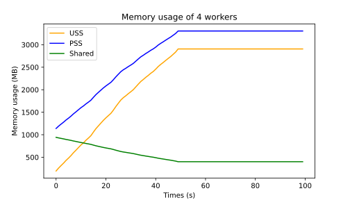

## Immutability Options

When creating a dataset you can choose between the immutability options `copy` and `pickle`. If you are working with multiple processes in parallel each child process will share its entire memory space with the main process. 

Usually the data of the dataset consists of many python objects, e.g. `dict`, `list`, ... . When a process reads/touches a value, the reference counter for the object will be increased, which triggers a copy. So the Linux behaviour of "copy-on-write" is a "copy-on-read" for Python objects. Therefore if the processes access the dataset it will be loaded into the RAM multiple times.
While the `copy` option gives a complete copy of the dataset to each process, the `pickle` option uses bytestreams and compresses the data so the memory usage is decreased compared to `copy`.

This was originally observed in  https://ppwwyyxx.com/blog/2022/Demystify-RAM-Usage-in-Multiprocess-DataLoader/ and the blog also contains more details about it.

For datasets created from a list you can also choose a third option `wu` which uses numpy arrays instead of many python objects to store the dataset in the memory. By doing so the "copy-on-read" effect does not trigger and the child process can access the datset from the main process without copying the data.
Therefore by using the `wu` option you can prevent each process to have its own copy of the dataset stored in the RAM and instead share the dataset from the main process. Because of that the dataset does not need to be loaded into the RAM multiple times and the RAM memory usage can be reduced as shown in the diagrams below.

Immutable_warranty=: copy

Immutable_warranty: pickle

Immutable_warranty: wu

 

Where the displayed USS (Unique Set Size) is the sum of all single USSs of each worker. The USS of one worker is the amount of RAM that is unique to that process and not shared with other processes.

Shared in the diagram represents the mean RAM of the processes that is shared with other processes. 

The displayed PSS ("Proportional Set Size") is the sum of all single PSSs. The PSS of one process is all the memory the proccess holds in RAM, so the sum of USS and shared, but the shared memory is divided by the number of processes sharing it.

The `pickle` option delivers a good compression of the data and reduces the used memory for one worker.
For multiple processes the `wu`-option can be more stable since the data does not need to be loaded into the RAM multiple times and the memory usage stays roughly constant over time.

